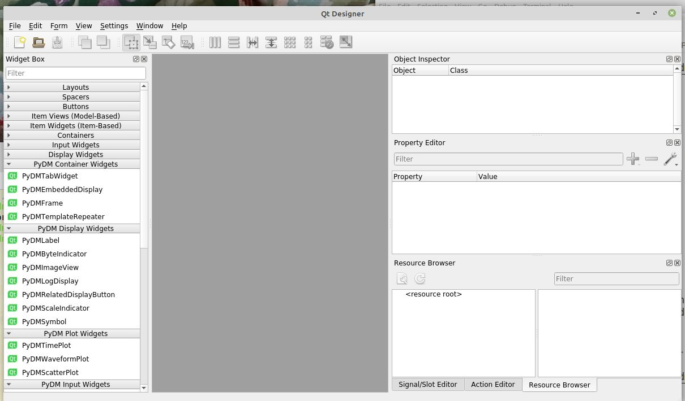

# Installation of PyDM

Installation of PyDM (in linux) is [explained](http://slaclab.github.io/pydm/installation.html),
yet the procedure does not always result in Qt's designer
finding the PyDM widget definitions.

Here we explore different installation methods,
using custom conda environments.

## As the PyDM documentation states ...

Installation per [PyDM Documentation](http://slaclab.github.io/pydm/installation.html)

```
cd /tmp
conda create -y -n pydm-environment python=3.6 pyqt=5 pip numpy scipy six psutil pyqtgraph -c conda-forge
# source activate pydm-environment
conda activate pydm-environment
git clone https://github.com/slaclab/pydm.git
cd pydm
pip install .[all]
export PYQTDESIGNERPATH=/tmp/pydm/pydm/pydm_designer_plugin.py
```

Then, run the Qt designer and check for the existence of the PyDM widgets.

```
designer
```

As this starts, the console should show this text (user, host, & directory will vary):

```
(pydm-environment) user@host:~ $ designer
Loading PyDM Widgets
```

Here's a view of the screen (with the standard Qt widget categories minimized):



## slight modifications

In the documented installation procedure, pip is used to install *pydm*.
Other packages are also installed with pip, per the stated requirements.
Some of these additional packages require building.
We can install those requirements as *pre-built packages* with [conda]() instead.

Also, we had to point into the source directory for PyDM's plugins
for Qt designer to use.  Those should be installed into the environment
instead.  There is a default location: `${CONDA_PREFIX}/etc/pydm/`

```
cd /tmp
conda create -y -n pydm-environment python=3.6 pyqt=5 pip numpy scipy six psutil pyqtgraph -c conda-forge
conda activate pydm-environment

# install all other required packages with conda
conda install -y pyepics qtpy requests codecov coverage pytest "pytest-cov<2.6.0" pytest-qt -c conda-forge

git clone https://github.com/slaclab/pydm.git
cd pydm
pip install .[all]

# install the designer plugins
mkdir -p ${CONDA_PREFIX}/etc/pydm
cp /tmp/pydm/pydm_designer_plugin.py ${CONDA_PREFIX}/etc/pydm/
export PYQTDESIGNERPATH=${CONDA_PREFIX}/etc/pydm
```

As before, test that designer finds the plugins when it starts.

## Full conda installation

Since the documentation was written, there is now a 
[pydm](https://anaconda.org/conda-forge/pydm)
pre-built package for installation with conda.
(This package is built as `noarch` which means it is not dependent
on a specific architecture such as linux-x86_64.)

```
cd /tmp
conda create -y -n pydm-environment python=3.6 pyqt=5 pip numpy scipy six psutil pyqtgraph -c conda-forge
conda activate pydm-environment

# install all other required packages with conda
conda install -y pyepics qtpy requests codecov coverage pytest "pytest-cov<2.6.0" pytest-qt -c conda-forge

conda install -y pydm -c conda-forge
```

Again, check that designer finds the plugins.  (We do not need to define
`PYQTDESIGNERPATH` everry time we activate the environment.  
It will be set for us *as* conda activates the environment.)
This time, the text `Loading PyDM Widgets` is not printed but
the designer still shows controls for the PyDM widgets.

## Full conda installation - latest versions all

The previous conda instructions installed pydm 1.6.2.
The current release on [conda-forge](https://anaconda.org/search?q=pydm)
is 1.7.3.  Also, the installations above all used python=3.6, 
yet the current python is now 3.7. 

```
cd /tmp
conda create -y -n pydm-environment python pydm -c conda-forge
conda activate pydm-environment
```

Again, confirm that designer finds the PyDM widget controls.

Finally, test that PyDM works by creating a screen that displays
PV content from some IOC, preferably content that updates, such as
`xxx:UPTIME`.
